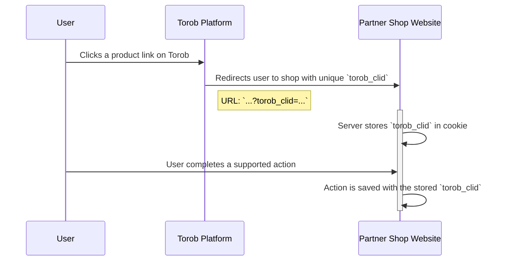
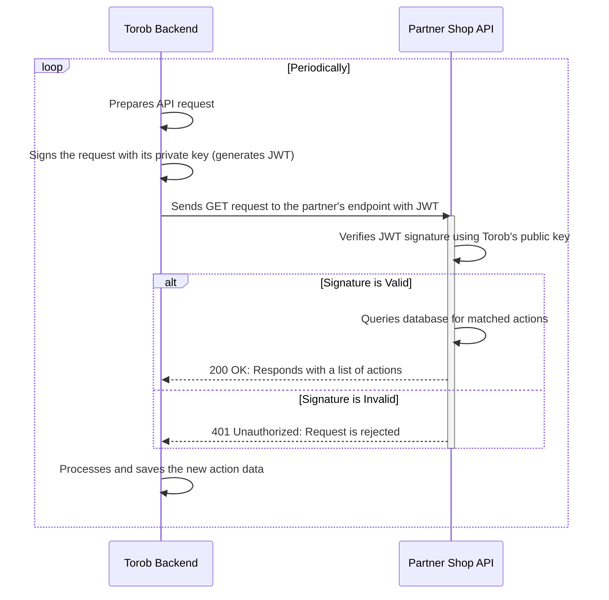

# Action Tracking API: Implementation Guide for Partner Shops
## Specification for the `/torob/v1/actions` Endpoint

## 0. Diagram

### Part 1: User Click & Action Attribution
This diagram shows how a user's click is tracked and associated with an action on the partner's website.



### Part 2: Backend Data Synchronization
This diagram shows how our backend system retrieves action data from your API.



## 1. Introduction
This document outlines the technical requirements for implementing an action tracking system. To enable attribution and other features on our platform, partner shops can implement this secure API endpoint. It is designed to provide action data for users we refer to their site.

Crucially, this endpoint must only expose action information for users that originated from our platform (i.e., actions that have an associated `torob_clid`). This system allows for a transparent, performance-based partnership.

## 2. Workflow Overview
The action tracking process follows these steps:

1. **User Redirection**: A user on our platform clicks a link to your website. We append a unique Torob click id `torob_clid` as a query parameter in the URL.
   - **Example**: `https://www.yourshop.com/product/123?torob_clid=a1b2c3d4-e5f6-7890-g1h2-i3j4k5l6m7n8`

2. **Capture torob_clid**: Your system must capture and store this `torob_clid` and associate it with the user's cookie.

3. **Attribute Action**: When the user completes a supported action, the `torob_clid` must be saved along with the action details.

4. **Data Pull**: We will periodically call your API endpoint to retrieve new or updated action information.

## 3. API Implementation Requirements
You are required to create a secure, RESTful API endpoint that we can poll for action data. The data returned from this endpoint must be filtered to include only actions completed by users we referred to your site.

### 3.1. Feature Enablement for Shop Generators
For shop generator platforms and reusable integrations (such as Mixin, WooCommerce, and similar systems), this action tracking feature must be controllable per shop.

- The feature must not be permanently enabled for all shops by default.
- There must be a setting or configuration option that allows each shop to enable or disable the action tracking integration for its own store.
- Shops must be able to turn this access on or off whenever they want.
- If a shop has not enabled this access, the API must not return action data to Torob and should respond with HTTP `403`.

This requirement ensures that each shop explicitly controls whether Torob can access its action tracking data.

### 3.2. Endpoint & Authentication
- **URL**: You will need to provide us with a stable URL for your API endpoint.
  - **URL Structure**: Your endpoint must follow the structure `https://[your_api_hostname]/[optional_path]/torob/v1/actions`, which is composed of the following parts:
    - `[your_api_hostname]`: The domain or subdomain of your API (e.g., `api.yourshop.com`).
    - `[optional_path]`: An optional base path if your architecture requires it (e.g., `/api/integrations/`). If not needed, this can be omitted.
    - `/torob/v1/actions`: The required path for the endpoint. The URL you provide **must** end with this path. This ensures consistency across all partner integrations.
  - **Example URLs**:
    - **Simple Structure**: `https://api.yourshop.com/torob/v1/actions`
    - **Structure with Optional Path**: `https://yourshop.com/api/torob/v1/actions`
- **Method**: `GET`
- **Authentication**: All requests to your endpoint will be authenticated using a JSON Web Token (JWT). By validating this token, you can ensure that the request originates from Torob and prevent unauthorized access. The token is signed using the EdDSA (ed25519) algorithm.

#### Torob Public Key
You must use the following public key to validate the signature of the JWT included in each request.

```pem
-----BEGIN PUBLIC KEY-----
MCowBQYDK2VwAyEAt6Mu4T0pBORY11W+QeM35UsmLO3vsf+6yKpFDEImFk0=
-----END PUBLIC KEY-----
```

#### Request Headers
Each request will include the following headers for authentication:

| Header                  | Example                            | Description                                                           |
| ----------------------- | ---------------------------------- | --------------------------------------------------------------------- |
| `X-Torob-Token`         | (a long base64 encoded JWT string) | The JWT used for authentication. Your server must validate this token. |
| `X-Torob-Token-Version` | `1`                                | The version of the token authentication scheme being used.             |

#### JWT Validation Logic
The JWT payload contains several important claims you must validate:

**Sample Decoded JWT:**
```json
{
  "header": {"alg": "EdDSA", "typ": "JWT", "v": 1},
  "payload": {"aud": "api.yourshop.com", "exp": 1730206744, "nbf": 1730206000}
}
```

**Claim Details:**

- `exp` **(Expiration Time)**: A Unix epoch timestamp (in seconds). Your server must reject any request where the current time is past this timestamp.
- `nbf` **(Not Before)**: A Unix epoch timestamp (in seconds). Your server must reject any request where the current time is before this timestamp.
- `aud` **(Audience)**: This value must exactly match the `Host` header of the request (e.g., `api.yourshop.com` or `api.yourshop.com:8080`). This check is critical to ensure that a token generated for one partner cannot be used for another.

Many standard JWT libraries automatically validate the `exp` and `nbf` claims, but you must ensure the `aud` claim is also verified against your API's hostname.

> **Note on Server Time**: Correct server time synchronization is crucial. If your server's clock is inaccurate, it may incorrectly reject valid tokens.

### 3.3. Request Parameters
We will poll your endpoint for new or updated records since our last request. Your endpoint must support filtering by action timestamp.

| Parameter      | Type    | Required | Description                                                                                                             |
| -------------- | ------- | -------- | ----------------------------------------------------------------------------------------------------------------------- |
| `timestamp_gt` | String  | Yes      | "Greater Than". Returns all actions from your platform with a `timestamp` greater than the specified value. The value must be in ISO 8601 format (UTC). |
| `limit`        | Integer | Yes      | The maximum number of records to return. The value must be greater than 0 and less than or equal to 1000.                |

**Example Request**: `GET https://api.yourshop.com/torob/v1/actions?timestamp_gt=2025-09-21T10:00:00.000000Z&limit=1000`

### 3.4. Response Format
The response must be a JSON object with the `Content-Type` header set to `application/json`. The records must be sorted in ascending order by their `timestamp`.

#### Success Response (200 OK)
```json
{
  "success": true,
  "data": [
    {
      "timestamp": "2025-09-21T10:20:30.456789Z",
      "last_updated_timestamp": "2025-09-21T10:20:30.456789Z",
      "torob_clid": "a1b2c3d4-e5f6-7890-g1h2-i3j4k5l6m7n8",
      "status": "completed",
      "action_type": "example_action"
    }
  ]
}
```

#### No New Actions Response (200 OK)
If there are no new actions matching the query, return an empty `data` array.

```json
{
  "success": true,
  "data": []
}
```

#### Access Disabled Response (403)
If the shop has not allowed Torob to access its action data, the endpoint should return HTTP `403` instead of returning action records.

### 3.5. Response Field Details
> **Note**: All timestamps must be provided in the ISO 8601 format and specified in the UTC timezone, indicated by a `Z` suffix (e.g., `2025-09-21T10:20:30.456789Z`).

| Field                    | Type   | Required | Description |
| ------------------------ | ------ | -------- | ----------- |
| `timestamp`              | String | Required | The ISO 8601 timestamp (UTC) of when the action initially happened. |
| `last_updated_timestamp` | String | Required | The ISO 8601 timestamp (UTC) of when the action was last modified. For new actions, this can be the same as `timestamp`. |
| `torob_clid`             | String | Required | The unique tracking identifier passed to you on user redirection. |
| `status`                 | String | Required | The current status of the action. Must be one of `completed` or `cancelled`. |
| `action_type`            | String | Required | The type of action. |

Only these top-level fields are required in every action:

- `timestamp`
- `last_updated_timestamp`
- `torob_clid`
- `status`
- `action_type`

#### Status Choices

| Value       | Description |
| ----------- | ----------- |
| `completed` | The action finished successfully. |
| `cancelled` | The action was cancelled. |

## 4. Action Cancellations & Updates
To account for cancelled actions, you must provide updates for up to 7 days after the initial action timestamp.

When an action is cancelled, update its `status` to `cancelled` and update its `last_updated_timestamp`.

Our polling system will retrieve these updated records periodically.

## 5. Appendix: Code Samples for JWT Validation
The following samples demonstrate how to validate the `X-Torob-Token` JWT in various programming languages.

### Python
This example uses the `pyjwt[crypto]` library.

```python
import jwt

PUBLIC_KEY = f"""
-----BEGIN PUBLIC KEY-----
MCowBQYDK2VwAyEAt6Mu4T0pBORY11W+QeM35UsmLO3vsf+6yKpFDEImFk0=
-----END PUBLIC KEY-----
"""


def validate_token(token: str):
    # exp and aud fields are checked by PyJWT library.
    jwt.decode(token, key=PUBLIC_KEY, algorithms=["EdDSA"], audience="[expected_aud_value]")
```

### Go
This example uses the `github.com/golang-jwt/jwt/v5` library.

```go
package main

import (
	"crypto"
	"fmt"
	"github.com/golang-jwt/jwt/v5"
	"log"
)

func verify(token string, parser *jwt.Parser, key crypto.PublicKey) (*jwt.Token, error) {
	parsedToken, err := parser.ParseWithClaims(token, &jwt.MapClaims{}, func(token *jwt.Token) (interface{}, error) {
		return key, nil
	})
	if err != nil {
		return nil, fmt.Errorf("unable to parse token: %v", err)
	}
	return parsedToken, nil
}

func main() {
	publicKey := []byte(`-----BEGIN PUBLIC KEY-----
MCowBQYDK2VwAyEAt6Mu4T0pBORY11W+QeM35UsmLO3vsf+6yKpFDEImFk0=
-----END PUBLIC KEY-----`)
	publicKeyPem, err := jwt.ParseEdPublicKeyFromPEM(publicKey)
	if err != nil {
		log.Fatal(err)
	}
	// aud and exp fields are checked by jwt library
	parser := jwt.NewParser(jwt.WithAudience("[expected_aud_value]"), jwt.WithExpirationRequired(), jwt.WithValidMethods([]string{"EdDSA"}))
	// parser and publicKeyPem are constant and should be computed only once in your code.
	// token is the JWT token received from the client.
	token := "..."

	if _, err = verify(token, parser, publicKeyPem); err != nil {
		log.Fatal(err)
	}
}
```

### Java
This example uses the `io.jsonwebtoken:jjwt` library.

```java
import io.jsonwebtoken.*;
import io.jsonwebtoken.io.Decoders;
import java.security.*;
import java.security.spec.*;


public class JwtVerifier {
    private final JwtParser parser;

    public JwtVerifier() throws NoSuchAlgorithmException, InvalidKeySpecException {
        final var publicKeyString = "MCowBQYDK2VwAyEAt6Mu4T0pBORY11W+QeM35UsmLO3vsf+6yKpFDEImFk0=";
        KeySpec keySpec = new X509EncodedKeySpec(Decoders.BASE64.decode(publicKeyString));
        PublicKey publicKey = KeyFactory.getInstance("EdDSA").generatePublic(keySpec);
        // aud and exp fields are checked by library.
        parser = Jwts.parser().requireAudience("[expected_aud_value]").verifyWith(publicKey).build();
    }

    public Jws<Claims> verifyToken(String token) {
        return parser.parseSignedClaims(token);
    }
}
```

### PHP
This example uses the `firebase/php-jwt` library.

```php
use Firebase\JWT\JWT;
use Firebase\JWT\Key;

define('TOROB_PUBLIC_KEY','MCowBQYDK2VwAyEAt6Mu4T0pBORY11W+QeM35UsmLO3vsf+6yKpFDEImFk0=');
define('TOROB_PUBLIC_KEY_SEED',base64_encode(substr(base64_decode(TOROB_PUBLIC_KEY), -32)));

function verify($jwt): object {
    // exp is checked by library but we should check aud manually.
    $decoded = JWT::decode($jwt, new Key(TOROB_PUBLIC_KEY_SEED, 'EdDSA'));
    if ($decoded->aud !== "[expected_aud_value]") {
        throw new \Exception("Invalid audience");
    }
    return $decoded;
}
```
