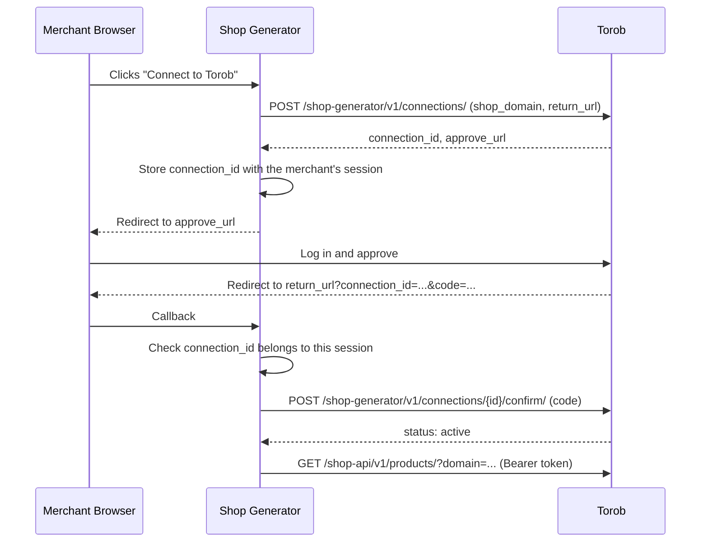

# Shop API: Integration Guide
## Manage a Torob Shop Panel From Code

## 0. Diagram

How a shop generator connects to a shop:



## 1. Introduction

The Shop API lets shops and shop generators (shop builders) do from code what the Torob shop panel
does: read the shop's products as Torob sees them, turn products on or off on Torob, read the shop's
product stats and clicks on Torob, and answer users' price reports.

- **Shops** call the API for their own shop with a token they create in their Torob shop panel.
- **Shop generators** call it on behalf of the shops built on their platform. Each shop must
  approve the generator once (section 3).

This API is the reverse direction of the [Product API](product_api_v3.md): there, Torob calls your
server; here, your server calls Torob.

## 2. Authentication

Every request carries a token in the `Authorization` header:

```
Authorization: Bearer <token>
```

Never send the token in the URL.

### 2.1. Shops

Shop tokens are created on the **API access** page of the Torob shop panel
(<https://panel.torob.com/s/apiAccess>). For now that page is open only to Torob support, so ask
Torob support for a token. The token is shown only once; store it safely. Creating a new token
revokes the previous one. A token stops working if the user who created it is removed from the
shop.

A shop token works only for its own shop. The `domain` parameter (section 4) is optional; if you
send it, it must be your shop's domain.

The token Torob installs in the WooCommerce plugin is separate and keeps working; it cannot call
this API.

### 2.2. Shop Generators

Use the partner token Torob gave your platform. It only works from your registered IP addresses.
Before calling the Shop API for a shop, connect to that shop (section 3), then send its domain in
the `domain` parameter of every request.

## 3. Connecting a Shop (Shop Generators)

### 3.1. Steps

1. **Request a connection** from your server with `POST /shop-generator/v1/connections/`. Store the
   returned `connection_id` together with the merchant's session in your system.
2. **Redirect the merchant's browser** to the returned `approve_url`.
3. **The merchant approves on Torob.** They log in with their Torob account, and Torob checks that
   they are a user of the shop. The browser then returns to your `return_url` with
   `connection_id` and `code`, or with `error=denied`.
4. **Check the callback.** The `connection_id` in the callback must be the one you stored for
   **this** browser session. If it is not, stop: the approval belongs to someone else.
5. **Confirm** with `POST /shop-generator/v1/connections/{connection_id}/confirm/` and the `code`.
   Only now is the connection active.

The whole flow, from step 1 to step 5, must finish within 15 minutes.

Step 4 is what stops a merchant on your platform from claiming another shop's domain: the approval
redirect goes to the real owner's browser, not theirs. Do not skip it.

### 3.2. Connection Object

```json
{
  "connection_id": "75a60226-4997-4ae3-bd10-68f7014e0779",
  "shop_domain": "example.ir",
  "status": "pending",
  "approve_url": "https://api.torob.com/shop-panel/shop-connections/75a60226-4997-4ae3-bd10-68f7014e0779/approve/"
}
```

| Field | Type | Description |
| ----- | ---- | ----------- |
| `connection_id` | string | Connection identifier |
| `shop_domain` | string | The shop's domain |
| `status` | string | `pending`, `approved`, `active`, `revoked`, or `expired` |
| `approve_url` | string or null | Where to send the merchant; set only while `pending` |

### 3.3. Endpoints

| Method | Path | Description |
| ------ | ---- | ----------- |
| `POST` | `/shop-generator/v1/connections/` | Request a connection. Body: `{"shop_domain": "...", "return_url": "https://..."}`. Returns an active connection as is; anything else starts a new request. |
| `GET` | `/shop-generator/v1/connections/{connection_id}/` | Read a connection's status. |
| `POST` | `/shop-generator/v1/connections/{connection_id}/confirm/` | Activate an approved connection. Body: `{"code": "..."}`. |
| `DELETE` | `/shop-generator/v1/connections/{connection_id}/` | Disconnect, for example when a merchant leaves your platform. Returns 204. |

`return_url` must use `https` (plain `http` is accepted only for `localhost` and `127.0.0.1`, for
local testing).

A shop can also revoke your access at any time from its Torob shop panel. After that, Shop API
calls for that shop return 403 until the shop approves a new connection.

## 4. Shop API

- **Base URL**: `https://api.torob.com/shop-api/v1/`
- **Content-Type**: `application/json`
- **`domain` query parameter**: the shop the request acts on. Required for shop generators,
  optional for shops.

### 4.1. Product Object

| Field | Type | Description |
| ----- | ---- | ----------- |
| `product_id` | string | Your product ID (the shop's own identifier) |
| `page_url` | string | Product page on the shop's site |
| `statuses` | list[string] | Torob statuses in priority order (section 4.2); the first one is the product's main status. Empty when the product has no problem |
| `price` | integer | Current price on Torob, in tomans |
| `availability` | boolean | In stock |
| `error_title` | string | The last crawl error, empty when none |
| `updated_at` | datetime | When Torob last changed this product |

Products removed permanently for technical reasons are not returned.

### 4.2. Product Statuses

A product can have several statuses at once; for example, a deactivated product that is also out of
stock has both. `statuses` lists them in the order of this table, and the first one is the
product's **main status**, the one the shop panel shows in its product list. The `status` filter of
`GET /products/` also works on the main status.

| Status | Meaning |
| ------ | ------- |
| `page_deleted_permanent_content` | Permanently removed for its content |
| `page_deleted_temporary_content` | Temporarily removed for its content |
| `page_deleted_temporary_technical` | Temporarily removed for a technical reason |
| `page_not_active` | Deactivated |
| `page_not_accessible` | The product page could not be reached |
| `in_progress_add` | Being added to Torob |
| `page_not_available` | Out of stock |
| `base_not_confirmed` | Category waiting for confirmation |
| `price_not_valid` | Price marked invalid |
| `base_not_merged` | Not merged (in categories where merging is required) |
| `base_image_rejected` | One or more images are not shown on Torob |

### 4.3. `GET /shop/`

Returns the shop the request acts on. Use it to check your token or connection.

```json
{"domain": "example.ir", "name": "فروشگاه نمونه"}
```

### 4.4. `GET /products/`

All of the shop's products, newest first, with cursor pagination.

| Parameter | Type | Required | Description |
| --------- | ---- | -------- | ----------- |
| `domain` | string | Generators | The shop |
| `page_size` | integer | Optional | Items per page, default 100, at most 500; a larger value is treated as 500 |
| `cursor` | string | Optional | Taken from a previous `next` or `previous` link (an invalid cursor gets 400) |
| `status` | string | Optional | Only products whose main status is this one (section 4.2), or `no_problem` for products with no status; an unknown value gets 400 |
| `updated_since` | datetime | Optional | Only products changed at or after this time (ISO 8601; without an offset it is UTC) |

```json
{
  "previous": null,
  "next": "https://api.torob.com/shop-api/v1/products/?cursor=cD0xMjM0NQ%3D%3D&domain=example.ir&page_size=100",
  "results": [
    {
      "product_id": "12412_1",
      "page_url": "https://example.ir/product/34/",
      "statuses": [],
      "price": 1250000,
      "availability": true,
      "error_title": "",
      "updated_at": "2026-10-07T08:15:30.120000+00:00"
    }
  ]
}
```

Follow `next` until it is `null`.

To sync only changes, pass the largest `updated_at` you received, minus a few minutes, as the next
`updated_since`. A change can become visible a little after it happened, so the overlap makes sure
nothing is missed; some products may come back twice. URL-encode the value (an unencoded `+` in
`+03:30` turns into a space), or send it in UTC with `Z`, for example `2026-10-07T08:00:00Z`.

### 4.5. `POST /products/`

The products with the IDs you send, in the same product shape as the list (section 4.1); for example,
to check a few products after changing their prices on your site. The IDs go in the body so their
number is not limited by the URL length.

Body: `{"product_ids": ["12412_1", "12412_2", "missing"]}` — 1 to 500 of your product IDs.

```json
{
  "results": [
    {
      "product_id": "12412_2",
      "page_url": "https://example.ir/product/35/",
      "statuses": ["page_not_active"],
      "price": 980000,
      "availability": true,
      "error_title": "",
      "updated_at": "2026-10-07T09:40:00+00:00"
    }
  ]
}
```

- Products come newest first. IDs that match no product are left out.
- Everything comes back in one response, without pagination. More than 500 IDs get 400; split them
  into several requests.
- A product you activated or deactivated a moment ago shows its new state right away.

### 4.6. `POST /products/activate/` and `POST /products/deactivate/`

Turn products on or off on Torob. A deactivated product stops showing on Torob until it is
activated again.

Body: `{"product_ids": ["12412_1", "missing"]}` — 1 to 5,000 product IDs.

```json
{"results": [{"product_id": "12412_1", "found": true}, {"product_id": "missing", "found": false}]}
```

### 4.7. `GET /summary/`

How many of the shop's products are in each group, and why products are not accessible. Use it to
show the shop's Torob stats in your own dashboard.

```json
{
  "calculated_at": "2026-10-07T13:00:00Z",
  "total": 900,
  "available": 600,
  "not_available": 100,
  "not_accessible": 100,
  "not_active": 50,
  "deleted": 50,
  "not_accessible_errors": [{"error_title": "404:download_http_status_error", "count": 70}]
}
```

| Field | Meaning |
|---|---|
| `total` | All of the shop's products on Torob |
| `deleted` | Deleted |
| `not_active` | Not deleted, but deactivated |
| `not_accessible` | Active, but Torob cannot reach the product page |
| `not_available` | Reachable, but out of stock |
| `available` | Reachable and in stock |
| `not_accessible_errors` | Why products are not accessible, largest first, in the same format as a product's `error_title` |
| `calculated_at` | When these numbers were computed; `null` for a new shop before its first computation, with all counts 0 |

- The groups do not overlap and add up to `total`.
- The numbers are not live: the counts are recomputed at least every two days, and the error
  reasons about once a day. For current numbers, use `GET /products/` with the `status` filter.

### 4.8. `GET /clicks/`

The clicks on the shop's products during one day (Tehran time), newest first, paginated.

| Parameter | Type | Required | Description |
| --------- | ---- | -------- | ----------- |
| `domain` | string | Generators | The shop |
| `date` | date | Yes | The day, `YYYY-MM-DD`, in Tehran time; a future day gets 400 |
| `click_type` | string | Optional | Only `normal`, `adv_click_bid` (special clicks), or `torobpay` clicks |
| `is_guaranteed` | boolean | Optional | `true` for only clicks with a guarantee buy-box cost |
| `page` | integer | Optional | Page number, from 1 |
| `page_size` | integer | Optional | Items per page, default 50, at most 500 |

```json
{
  "count": 14,
  "results": [
    {
      "product_id": "12412_1",
      "product_url": "https://example.ir/product/34/",
      "clicked_at": "2026-10-01T09:00:00+00:00",
      "new_session": true,
      "ip": "192.0.2.1",
      "click_type": "normal",
      "click_price": 500,
      "product_price": 1250000,
      "buybox_click_price": 0
    }
  ]
}
```

| Field | Meaning |
| ----- | ------- |
| `product_id` | Your product ID; also present for products since deleted from Torob |
| `product_url` | The product page; `null` for deleted products |
| `new_session` | Whether this is the user's first click on the shop in a session |
| `click_price` | What the click costs the shop, in tomans. Repeat clicks in a session, and clicks of shops that pay per order (CPO), cost 0 |
| `product_price` | The product's price at click time, in tomans; 0 means out of stock |
| `buybox_click_price` | The click's guarantee buy-box cost, in tomans |

Clicks from the last six hours are not returned, because fake clicks are found and removed within
that time. Today's list fills in during the day.

### 4.9. `GET /price-reports/`

Torob users' reports about the shop's prices or stock, as on the price report page of the shop
panel, one item per product.

| Parameter | Type | Required | Description |
| --------- | ---- | -------- | ----------- |
| `domain` | string | Generators | The shop |
| `active_reports` | string | Optional | `active` (default) for current reports, or `inactive` for old ones |
| `page` | integer | Optional | Page number, from 1 |
| `page_size` | integer | Optional | Items per page, default 50, at most 500 |

```json
{
  "count": 2,
  "unanswered_count": 1,
  "results": [
    {
      "report_id": 4521,
      "product_id": "12412_1",
      "product_name": "Phone",
      "product_url": "https://example.ir/product/34/",
      "report_type": "price_change_after_order",
      "status": "received",
      "is_open": true,
      "report_count": 3,
      "first_reported_at": "2026-10-06T10:00:00+00:00",
      "reported_at": "2026-10-07T08:00:00+00:00",
      "price_at_report_time": 1250000,
      "current_price": 1250000,
      "user_descriptions": ["The price on the site was higher"]
    }
  ]
}
```

- `status` is the latest answer: `received` (not answered), `claimed_to_be_corrected`,
  `claimed_to_be_invalid`, or `invalidated_by_torob`.
- A report is open (`is_open`) while the product's price and stock have not changed since it was
  made. `unanswered_count` counts products with an open, unanswered report.

### 4.10. `POST /price-reports/answer/`

Answers the open reports of several products at once, as in the shop panel.

Body: `{"report_ids": [4521], "status": "claimed_to_be_corrected", "description": "Fixed the price"}`

- `report_ids`: 1 to 1,000 `report_id` values from the list above.
- `status`: `claimed_to_be_corrected` (you fixed the price or stock) or `claimed_to_be_invalid` (the
  report was wrong).
- `description`: optional, at most 200 characters.

```json
{"answered_report_ids": [4521]}
```

Products without an open, unanswered report are left out of `answered_report_ids`. Torob downloads
answered products again, and checks the price again after a `claimed_to_be_corrected` answer.

## 5. Errors and Limits

| Status | Body | Meaning |
| ------ | ---- | ------- |
| 400 | `{"error": "..."}` | The body is malformed or breaks a limit (`"invalid request body"`), or the connection `code` is wrong, used, or expired |
| 400 | `{"detail": "..."}` | A wrong `domain`, a missing `domain` for a generator, an unknown `status`, or an invalid `cursor` |
| 401 | `{"detail": "Unauthorized"}` | Missing or invalid token, or a request from an IP the token does not allow |
| 403 | `{"detail": "..."}` | The token may not do this: for example, no active connection to the shop, or the user who created a shop token was removed from the shop |
| 404 | `{"error": "..."}` | The connection or shop was not found |
| 429 | `{}` | Too many requests |

Each token may send up to 5 requests per second **for each shop**, across all Shop API endpoints. A
shop generator therefore gets 5 per second for every connected shop. Batch product IDs (up to 5,000
per request) instead of sending one request per product.

## 6. Example Requests

### List Products (Shop Generator)

```bash
curl --header "Authorization: Bearer <token>" \
     "https://api.torob.com/shop-api/v1/products/?domain=example.ir&page_size=100"
```

### Deactivate Products (Shop)

```bash
curl --header "Content-Type: application/json" \
     --header "Authorization: Bearer <token>" \
     --request POST \
     --data '{"product_ids": ["12412_1", "12412_2"]}' \
     "https://api.torob.com/shop-api/v1/products/deactivate/"
```

### Request a Connection (Shop Generator)

```bash
curl --header "Content-Type: application/json" \
     --header "Authorization: Bearer <token>" \
     --request POST \
     --data '{"shop_domain": "example.ir", "return_url": "https://generator.example/torob/callback"}' \
     "https://api.torob.com/shop-generator/v1/connections/"
```
