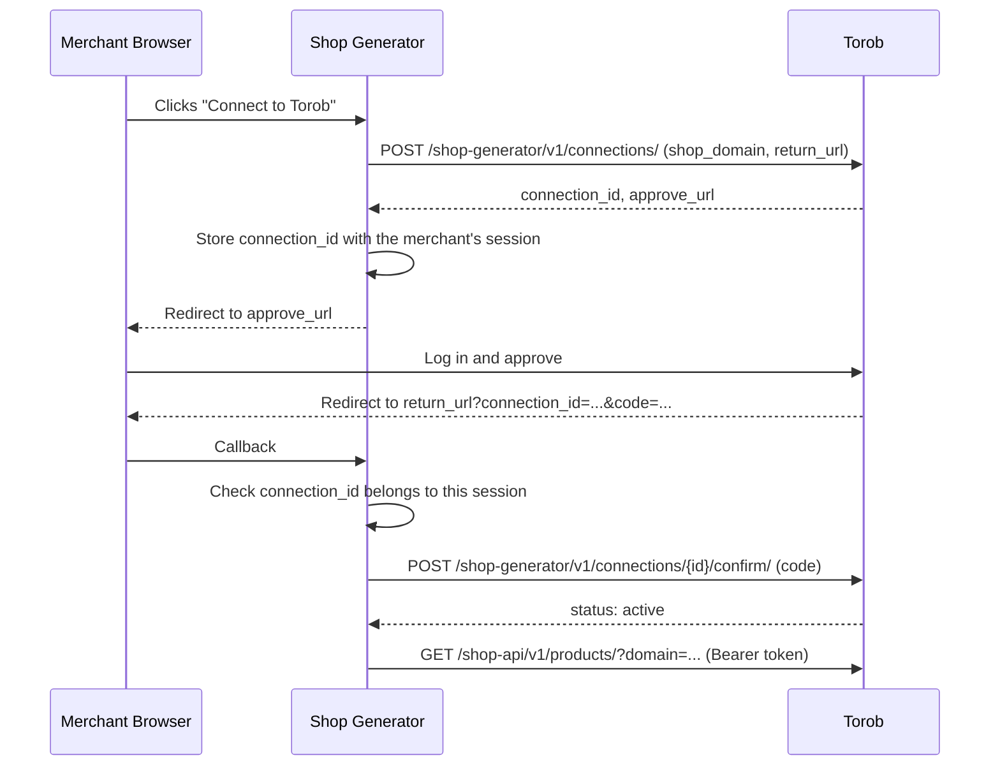

# Connecting a Shop: Shop Generator Guide
## Get a Shop's Approval to Use the Shop API on Its Behalf

This guide is for **shop generators** (shop builders). It explains how to get a shop's approval
before calling the [Shop API](shop_api.md) on its behalf. Shops do not need it.

You need a shop's approval once per shop. It lasts until the shop or you disconnect.

- **Base URL**: `https://api.torob.com/shop-generator/v1/`
- **Content-Type**: `application/json`

## 0. Diagram

How a shop generator connects to a shop:



## 1. Authentication

Use the partner token Torob gave your platform, in the `Authorization` header, never in the URL:

```
Authorization: Bearer <token>
```

The token only works from your registered IP addresses. You use the same token for the Shop API
once a shop is connected.

## 2. Steps

1. **Request a connection** from your server with `POST /shop-generator/v1/connections/`. Store the
   returned `connection_id` together with the merchant's session in your system.
2. **Redirect the merchant's browser** to the returned `approve_url`.
3. **The merchant approves on Torob.** They log in with their Torob account, and Torob checks that
   they are a user of the shop. The browser then returns to your `return_url` with
   `connection_id` and `code`, or with `error=denied`.
4. **Check the callback.** The `connection_id` in the callback must be the one you stored for
   **this** browser session. If it is not, stop: the approval belongs to someone else.
5. **Confirm** with `POST /shop-generator/v1/connections/{connection_id}/confirm/` and the `code`.
   Only now is the connection active.

The whole flow, from step 1 to step 5, must finish within 15 minutes.

Step 4 is what stops a merchant on your platform from claiming another shop's domain: the approval
redirect goes to the real owner's browser, not theirs. Do not skip it.

## 3. Connection Object

```json
{
  "connection_id": "75a60226-4997-4ae3-bd10-68f7014e0779",
  "shop_domain": "example.ir",
  "status": "pending",
  "approve_url": "https://api.torob.com/shop-panel/shop-connections/75a60226-4997-4ae3-bd10-68f7014e0779/approve/"
}
```

| Field | Type | Description |
| ----- | ---- | ----------- |
| `connection_id` | string | Connection identifier |
| `shop_domain` | string | The shop's domain |
| `status` | string | `pending`, `approved`, `active`, `revoked`, or `expired` |
| `approve_url` | string or null | Where to send the merchant; set only while `pending` |

## 4. Endpoints

| Method | Path | Description |
| ------ | ---- | ----------- |
| `POST` | `/shop-generator/v1/connections/` | Request a connection. Body: `{"shop_domain": "...", "return_url": "https://..."}`. Returns an active connection as is; anything else starts a new request. |
| `GET` | `/shop-generator/v1/connections/{connection_id}/` | Read a connection's status. |
| `POST` | `/shop-generator/v1/connections/{connection_id}/confirm/` | Activate an approved connection. Body: `{"code": "..."}`. |
| `DELETE` | `/shop-generator/v1/connections/{connection_id}/` | Disconnect, for example when a merchant leaves your platform. Returns 204. |

`return_url` must use `https` (plain `http` is accepted only for `localhost` and `127.0.0.1`, for
local testing).

A shop can also revoke your access at any time from its Torob shop panel. After that, Shop API
calls for that shop return 403 until the shop approves a new connection.

## 5. Errors

| Status | Body | Meaning |
| ------ | ---- | ------- |
| 400 | `{"error": "invalid request body"}` | The body is malformed, for example a missing field or a `return_url` that is not `https` |
| 400 | `{"error": "The code is invalid, used or expired."}` | On `confirm/`: the `code` is wrong, already used, or expired |
| 401 | `{"detail": "Unauthorized"}` | Missing or invalid token, or a request from an IP the token does not allow |
| 403 | `{"detail": "..."}` | The token is not a shop generator token |
| 404 | `{"error": "..."}` | No shop has this domain, or the connection was not found or is not yours |

## 6. After Connecting

Once the connection is `active`, call the [Shop API](shop_api.md) with the same token and send the
shop's domain in the `domain` parameter, for example `/shop-api/v1/products/?domain=example.ir`.
For a shop without an active connection, the Shop API returns 403.

## 7. Example Request

```bash
curl --header "Content-Type: application/json" \
     --header "Authorization: Bearer <token>" \
     --request POST \
     --data '{"shop_domain": "example.ir", "return_url": "https://generator.example/torob/callback"}' \
     "https://api.torob.com/shop-generator/v1/connections/"
```
